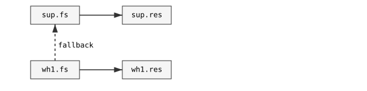

SlotFlow is a deterministic PHP engine for modeling and executing quantity flows across an explicit multidimensional state space.

## Mental Model

Think of SlotFlow as a constrained routing engine:

- each **slot** is a node in a graph
- each **edge** is an allowed movement
- a **cascade** is an ordered routing strategy

When you request a quantity movement, SlotFlow:

1. finds valid edges from the current state
2. orders them according to your policies
3. moves as much as possible
4. cascades the remainder to the next options

> SlotFlow makes quantity movements explicit, deterministic, and auditable.

SlotFlow is intentionally not an ERP, fulfillment system, or workflow framework. It is the lower-level engine those systems can build on.

## Core Model

- A `Slot` is one concrete state such as `wh1.FP.fs`.
  - The special `nil` slot represents outside-of-space flow: both source, sink, and effectively `/dev/null`.
- A `SlotSpace` is the finite universe of valid slots generated from named dimensions.
- An `Edge` is an allowed movement between two slots.
- A `Cascade` is an ordered routing strategy that defines how movement is attempted.
- `MovementEngine` executes a requested quantity against current inventory and returns movement events plus any remainder.

At its core, SlotFlow acts as a declarative execution engine over a constrained state space.

**Notes**

- Cascades can be instantiated independently, but are typically registered on a `SlotSpace` and referenced by name during execution.
- Cascades can be reversed with `reverseIf()` and parameterized, allowing a single definition to adapt to different execution contexts.

## When SlotFlow shines

SlotFlow is a good fit when:

- quantities exist in multiple states or locations
- movement rules are non-trivial or evolving
- allocation must be deterministic and explainable
- you need auditability (ledger-style tracking)

It is likely overkill for simple stock counters or single-location systems.

## Install

SlotFlow currently requires PHP 8.3.

```bash
composer require nandan108/slot-flow
```

## Minimal Example

```php
use Nandan108\SlotFlow\Cascade;
use Nandan108\SlotFlow\Inventory;
use Nandan108\SlotFlow\MovementEngine;
use Nandan108\SlotFlow\Policies\DimensionPriority;
use Nandan108\SlotFlow\SlotSpace;

$space = SlotSpace::define([
    'loc' => ['sup', 'wh1'],
    'stt' => ['fs', 'res', 'sd'],
])
->cascade('reserve', static fn (Cascade $cascade) => $cascade
    ->move(['stt' => 'fs'], ['stt' => 'res'])
    ->orderBy(new DimensionPriority([
        'loc' => ['wh*', 'sup'],
])));

$inventory = new Inventory($space, [
    [$space->slot(['wh1', 'fs']), 5],
    [$space->slot(['sup', 'fs']), 10],
]);

$result = (new MovementEngine())->execute(
    inventory: $inventory,
    space: $space,
    cascade: 'reserve',
    quantity: 6,
    subject: 'SKU-123',
);
```

`MovementEngine::execute()` accepts either a `Cascade` object or the name of a cascade registered on the provided `SlotSpace`. Named execution is often the cleaner option once your flows are part of the modeled space.

### How the cascade behaves



In this example:

- the engine first consumes `wh1.fs → wh1.res`
- then falls back to `sup.fs → sup.res`

So 5 units from `wh1.fs` to `wh1.res`, then cascade the remaining 1 unit from `sup.fs` to `sup.res`.

## Slightly more advanced routing

Cascades can express real-world fallback strategies, including backorders.

```php
$space = SlotSpace::define([
    'loc' => ['sup','wh1', 'wh2'], // sup: supplier, wh*: our warehouses
    'own' => ['S', 'P'],           // S: supplier-owned / P: purchased
    'stt' => ['fs', 'res', 'sd'],  // fs: for-sale, res: reserved, sd: sold
])
->cascade('backorder', static fn (Cascade $cascade) => $cascade
    // prioritize stock we already own
    ->move(['stt' => 'fs', 'own' => 'P'], ['stt' => 'res'])

    // prefer warehouse over supplier
    ->orderBy(new DimensionPriority(['loc' => ['wh*', 'sup'],]))

    // fallback: create supplier-owned reservation (backorder)
    // this represents stock that will be ordered from the supplier
    // Note: could also be written ->create('sup.S.res') or ->create(['sup','S','res'])
    ->create(['loc' => 'sup', 'own' => 'S', 'stt' => 'res'])
);
```

This cascade encodes a common allocation policy:

1. use purchased stock first
1. prefer stock already in your warehouses
1. if insufficient, create a supplier reservation (backorder)

This makes backordering an explicit, deterministic part of the flow.

The same policy also supports alternatives such as `'wh1|wh2'`, because priority entries are resolved through the configured slot codec before ranking edges. All values matched by the same entry share the same priority tier.

Registered cascade names pair especially well with parameterized templates: you define the flow once on the `SlotSpace`, then execute it by name with different `params` depending on the request.

## Execution Output

SlotFlow computes movement. It does not persist it.

It produces explicit, inspectable results that you can store, audit, or replay.

The main result shapes are:

- `MovementResult::mutations()` for net per-slot current-state deltas
- `MovementResult::ledgerEntries($context)` for append-only movement records
- `InventoryBatch::mutations()` and `InventoryBatch::ledgerEntries($context)` for the same outputs across many subjects

## Guide

- [Guide](docs/guide.md): step-by-step usage, patterns, ingestion, execution, and batch processing
- [Commerce Example](docs/commerce-example.md): a fuller e-commerce flow model
- [API Reference](docs/api-reference.md): full public signatures grouped by area
    - [SlotSpace](docs/api-reference.md#slotspace-api)
    - [Slot And Edge Rules](docs/api-reference.md#slot-and-edge-rules-api)
    - [Inventory](docs/api-reference.md#inventory-api)
    - [Cascade](docs/api-reference.md#cascade-api)
    - [Execution](docs/api-reference.md#execution-api)
    - [Policy](docs/api-reference.md#policy-api)
    - [Batch](docs/api-reference.md#batch-api)
